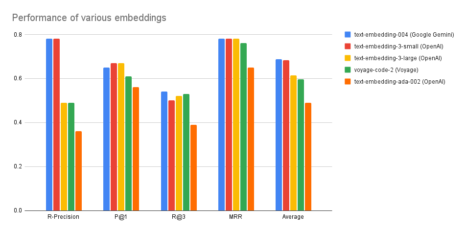
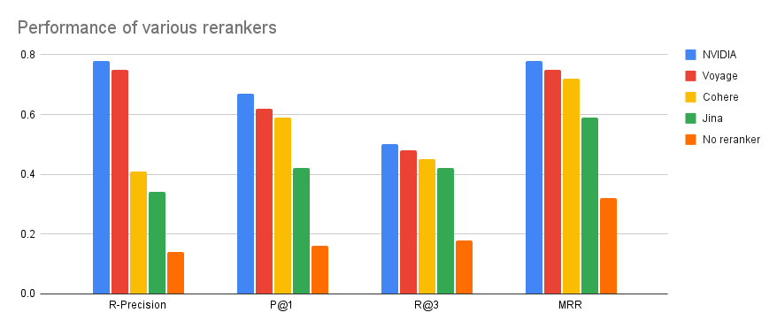

## Background
Our [Quickstart](quickstart) guide is meant to get you up and running as quickly as possible. Here we focus on more accurate answers, faster responses and a generally more reliable pipeline. Since there's no free lunch, the setup is more involved.

> In summary, this section walks you through the following steps:
> 1. Switch from LLM-based retrieval to vector-based retrieval.
> 2. Set up API keys for the embedder, vector store and reranker.
> 3. Index the codebase.
> 4. Enjoy the improved chat experience.

## Better retrieval
Responding to a user query involves two steps: (1) figuring out which files are the most relevant to the user query and (2) passing the content of these files together with the user query to an LLM.

### LLM-based retrieval
By default, we simply list all the file paths in the codebase and ask an LLM to identify which ones are most relevant to the user query. We expect the LLM to make a decision solely based on the paths. This is suboptimal for multiple reasons:
- Enumerating all the file paths might exceed the LLM context.
- The LLM has no visibility into the actual content of the files.

### Vector-based retrieval
A more principled way of retrieving relevant files invovles the following steps:
1. Chunk all the files into relatively equally-sized text snippets.
2. Embed the chunks (turn them into float vectors).
3. Store the chunks in a vector database.
4. At inference time, embed the user query and find its nearest neighbors in the vector database.

There are multiple components we need to set up:
- **An embedder**, which converts text into float vectors.
- **A vector store**, which stores the embeddings and performs nearest-neighbor search.
- **A reranker**, which takes the top N nearest neighbors retrieved from the vector score and re-order them based on the relevance to the user query.

In the following section, we will set API keys for these components.

### Setting up API keys

#### Embedder API keys
There are multiple third-party providers that offer batch embedding APIs. The plot below shows how well they perform on [our benchmark](https://github.com/Storia-AI/sage/tree/main/benchmarks/retrieval):


Overall, we recommend using OpenAI's `text-embedding-3-small` model, which achieves highest quality and has the fastest batch embedding API. Below you will find instructions for each provider:
<AccordionGroup>
    <Accordion title="OpenAI">
        1. Create an API key [here](https://platform.openai.com/api-keys).
        2. Export an environment variable:
        ```
        export OPENAI_API_KEY=...
        ```
    </Accordion>
    <Accordion title="Google Gemini">
        1. Create an API key following [these instructions](https://ai.google.dev/gemini-api/docs/api-key).
        2. Export it as an environment variable:
        ```
        export GOOGLE_API_KEY=...
        ```
    </Accordion>
    <Accordion title="Voyage">
        1. Create an API key following [these instructions](https://docs.voyageai.com/docs/api-key-and-installation).
        2. Export it as an environment variable:
        ```
        export VOYAGE_API_KEY=...
        ```
    </Accordion>
</AccordionGroup>

#### Vector store keys
Currently, we only support [Pinecone](https://pinecone.io) as a third-party managed vector database. We are actively working on adding more providers.

Here is how you can get it set up:
<AccordionGroup>
    <Accordion title="Pinecone">
    1. Create an API key following [these instructions](https://docs.pinecone.io/reference/api/authentication).
    2. Export it as an environment variable:
    ```
    export PINECONE_API_KEY=...
    ```
    </Accordion>
</AccordionGroup>

#### Reranker API keys
There are multiple third-party providers that offer reranking APIs.  The plot below shows how well they perform on [our benchmark](https://github.com/Storia-AI/sage/tree/main/benchmarks/retrieval):


We recommned using NVIDIA. Here are instructions for all the providers:
<AccordionGroup>
    <Accordion title="NVIDIA">
        1. Create an API key by following [these instructions](https://docs.nvidia.com/nim/large-language-models/latest/getting-started.html#generate-an-api-key). Note that API keys are model-specific. We recommend using `nvidia/nv-rerankqa-mistral-4b-v3`.
        2. Export an environment variable:
        ```
        export NVIDIA_API_KEY=...
        ```
    </Accordion>
    <Accordion title="Voyage">
        1. Create an API key following [these instructions](https://docs.voyageai.com/docs/api-key-and-installation).
        2. Export it as an environment variable:
        ```
        export VOYAGE_API_KEY=...
        ```
    </Accordion>
    <Accordion title="Cohere">
        1. Create an API key following [these instructions](https://docs.cohere.com/v2/docs/rate-limits).
        2. Export it as an environment variable:
        ```
        export COHERE_API_KEY=...
        ```
    </Accordion>
    <Accordion title="Jina">
        1. Create or get your API key following [these instructions](https://jina.ai/embeddings/).
        2. Export it as an environment variable:
        ```
        export JINA_API_KEY=...
        ```
    </Accordion>
</AccordionGroup>


## Indexing the codebase
Now that we have set up all the necessary keys, we are ready to index our codebase.

1. Install Sage. As a prerequisite, you need [pipx](https://pipx.pypa.io/stable/installation/).
```
pipx install git+https://github.com/Storia-AI/sage.git@main
```

2. Index the codebase. For instance, this is how you would index Hugging Face's [Transformers](https://github.com/huggingface/transformers) library using OpenAI embeddings and the NVIDIA reranker:
```
sage-index huggingface/transformers \
    --mode=remote \
    --embedding-provider=openai \  # options: openai, gemini, voyage
    --reranker-provider=nvidia  # options: nvidia, voyage, cohere, jina
```

## Chatting with the codebase
Once the codebase is indexed, the last piece to configure is the LLM that ingests the relevant files together with the user query to produce a response. We support OpenAI and Anthropic:
<AccordionGroup>
    <Accordion title="OpenAI">
        1. Create an API key [here](https://platform.openai.com/api-keys).
        2. Export an environment variable:
        ```
        export OPENAI_API_KEY=...
        ```
    </Accordion>
    <Accordion title="Anthropic">
        1. Create an API key following [these instructions](https://docs.anthropic.com/en/api/getting-started#accessing-the-api).
        2. Export it as an environment variable:
        ```
        export ANHTROPIC_API_KEY=...
        ```
    </Accordion>
</AccordionGroup>

Now we are finally ready to chat with the codebase and get much higher-quality answers:
```
sage-chat huggingface/transformers
    --mode=remote
    --llm-provider=openai  # options: openai, anthropic
    --llm-model=gpt-4      # optional
```
Happy chatting!

## Further customizations
Once you select the desired providers for embedding and reranking, we will use reasonable default models from each. For instance, we default to the `text-embedding-small-3` model from OpenAI. However, you can overwrite these defaults via command-line flags:

<ResponseField name="--embedding-model" type="string">
This is provider-specific. Make sure that the model belongs to the provider specified via `--embedding-provider`. Pass this flag to both `sage-index` and `sage-chat`.
</ResponseField>

<ResponseField name="--reranker-model" type="string">
This is provider-specific. Make sure that the model belongs to the provider specified via `--reranker-provider`. Pass this flag to `sage-chat`.
</ResponseField>

You can also customize the interaction with the Pinecone vector store by passing any of the following flags to **both** `sage-chat` and `sage-index`:

<ResponseField name="--pinecone-index-name" type="string">
By default, we create a new Pinecone index called `sage`. This flag allows you to specify an existing index to reuse.
</ResponseField>

<ResponseField name="--index-namespace" type="string">
Within a Pinecone index, you can have multiple namespaces. By default, we use the name of the repository (e.g. `huggingface/transformers`) for the namespace, but you can customize it via this flag.
</ResponseField>

<ResponseField name="--retrieval-alpha" type="float">
Pinecone supports [hybrid search](https://docs.pinecone.io/guides/data/understanding-hybrid-search), which combines dense (embedding-based) retrieval with sparse (BM25) retrieval. This flag represents the weight of *dense* retrieval. By default, we set it to 1.0 (i.e. fully dense).
</ResponseField>
